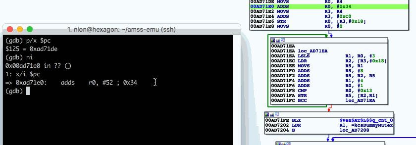

# gdbida - a visual bridge between a GDB session and IDA Pro's disassembler

The purpose of gdbida is to provide means during interactive debug sessions in
gdb to quickly follow the flow in IDA.  gdbida is not meant to be a full
debugger or replace IDA's own debugger. Instead, it merely serves as a small
helper tool to assist during interactive debug sessions that make use of a
mixture of tools. It provides simple means to quickly follow along a gdb debug
session in IDA. gdbida was originally meant to be used with gdb. However, e.g.
extending support to Windbg using pykd should be straight-forward.

gdbida consists of the following two parts:
* ida\_gdb\_bridge.py : main IDA Pro plugin
* gdb\_ida\_bridge\_client.py : gdb python script




Installation
============
Make a change the ~/.gdbinit configuration file to include the plugin:
```
source ~/gdb_ida_bridge_client.py
```

Copy the IDA plugin to your plugins directory, e.g.:
```
cp gdb_ida_bridge_client.py /Applications/IDA\ Pro\ 6.95/idaq.app/Contents/MacOS/plugins/
```

Execute the plugin from IDA and specify a listener address and port.
Next, configure the gdb stub to connect to gdbida's IDA port (either command line or gdbinit):
```
idabridge 10.0.10.10:2305
```

For debugging a PIE ELF binary,which is still relocated by the kernel, use the
following to translate text addresses at runtime:
```
idabridge 10.0.10.10:2305 reloc_text
```

Notes
=====
Please be aware that this is not considered to be finished. Specifically, the following thoughts are on my mind:
* Network listening input masks untested for errors.
* Individual TCP connections for 4 bytes payload are not ideal from a performance pov.
* The network connection is not authenticated in any way.
* A lot of potential for additional commands. For now, I kept it super simple.
* Color cleanup on exit is untested
